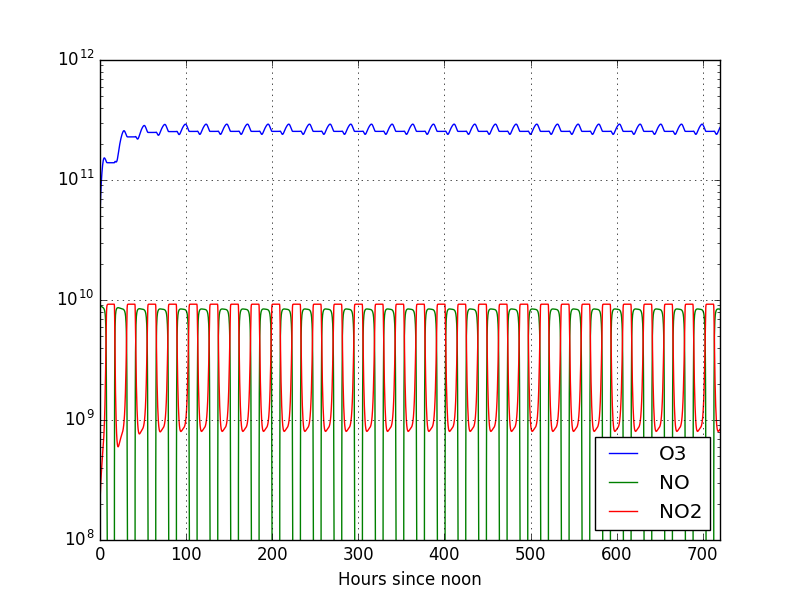
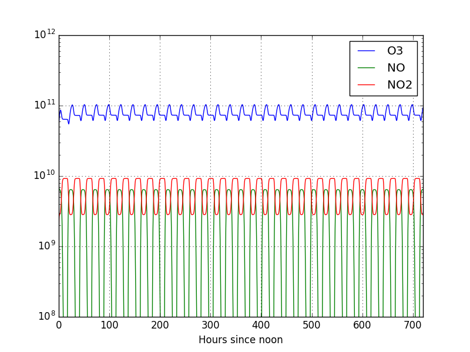

Modifying and improving the example
===================================

Increasing the length of the simulation
---------------------------------------

There are two ways to make modifications on the model. The first, which works
for simple changes, is to modify the Fortran code itself. The second is to
change the KPP model itself (the ``.def`` files etc.) before it gets compiled.
This latter method is more general, so this is the one we will focus on this
guide.  Since all we want for now is to increase the total time, we will base
ourselves in the original ``small_strato`` model and only modify this
parameter.

First, create another directory (anywhere you want) called ``test2`` (with
``mkdir test2``) and enter it (with ``cd test2``). Now create a file called
``my_strato.kpp`` (with ``notepad++ my_strato.kpp`` or ``gedit my_strato.kpp``
or whichever text editor you ended up using) and paste the following lines in
the file

.. include:: test2/my_strato.kpp
   :literal:

At this point if you run ``kpp my_strato.kpp`` you should get an error saying
``"Fatal error : my_strato.def: Can't read file"``. Which appears because we
instructed KPP to search for the file ``my_strato.def``, which doesn't exist in
the models directory. So we first must create the ``my_strato.def`` file, which
ultimately defines the ``my_strato`` model.

Let us define our model based on ``small_strato``, since for now all we want to
do is to modify the time length of the simulation. In order to preserve the
original ``small_strato.def`` we'll copy it and call it ``my_strato.def``, this
way we can do any modification on ``my_strato`` and the original
``small_strato`` will be safe. You can copy the file from the ``models``
directory into our working directory (``test2``) by issuing the following command::

 cp $KPP_HOME/models/small_strato.def my_strato.def

.. note::

 When we run KPP from any directory (say, ``test2``), KPP will first look for
 the files in the current directory and then in its home directory. So can
 either put our model files in our KPP "models" directory or in our current
 directory. In this guide we'll always prefer to keep the model we create/modify
 in the current directory.

Now you should open the file we just created (for example with ``notepad++``)
and find the lines that look like

.. code::

 #INLINE F90_INIT
         TSTART = (12*3600)
         TEND = TSTART + (3*24*3600)
         DT = 0.25*3600
         TEMP = 270
 #ENDINLINE

These are the lines that define the start, end, time step and global
temperature of the model. For now, we'll change only the end time. Notice that
they are given in seconds. For example, ``3*24*3600`` is the amount of seconds
in 3 days, meaning that at the moment the simulation is set to run for 3 days,
which we saw is not enough.  Let us then replace ``3`` with ``30``, meaning we
will run it for 30 days, to be sure that equilibrium is reached. Now that line
should read ``TEND = TSTART + (30*24*3600)``.

After this small change we are ready to test run the model. Run ``kpp
my_strato.kpp``, which should end with a ``succesfully created the model``
message. Now, just like with the previous example, open again the file
``Makefile_my_strato`` and uncomment the line that says ``COMPILER =
GFORTRAN``, so we can use Gfortran instead of Intel. After this is done compile
the model with ``make -f Makefile_my_strato``. Again, if everything goes well,
the ``my_strato.exe`` file should be created.

We can now run the model with ``./my_strato.exe``, which should now take 10
times longer to complete, since we are running it for 10 times as long as
before.  We can use the Python code given in the last section to read the
results. We just need to adjust the name of the file inside the code from
``small_strato`` to ``my_strato``.

The plot of the results is

.. _test2_time:

.. figure:: test20/test2_time.png
   :align: center
   :scale: 80 %

Now we can see that the solution stabilizes after roughly 200 hours! This was a
minor change in the model. Let us now change some other things and see how the
model reacts.

Change in the initial conditions
--------------------------------

We can use the same model as before (``my_strato``). Let's open the ``.def`` file
with located at ``$KPP_HOME/models/my_strato.def`` and consider an atmosphere with
more NO (simulating a polluted condition). Where it says ``NO  = 8.725E+08 ;``, we make it
read ``NO  = 9.00E+09``, which is roughly a 10 times increase in the NO concentration. Let us
also change the O3 initial condition and make the O3 line read ``O3  = 5.00E+10 ;``, simulating
an atmosphere that has a lower initial O3 concentration.

Let us also change the line that reads 

.. code::

   #LOOKATALL          {File Output}

We will make it read 

.. code:: 

   #LOOKAT O3; NO; NO2; {File Output}           

This latter change makes the program write only time, O3, NO and NO2 into the
output file, in that order. This simplifies the reading process and saves
space, since we are assuming that we're not interested in the other species.

We again go through the same steps: run it with ``kpp my_strato.kpp``, change the compiler
to gfortran, compile if with ``make -f Makefile_my_strato`` and run it with ``./my_strato.exe``.
This time, since the output file changed, we have to change the code to read it correctly:

.. include:: test2/plot_test21.py
   :literal:

This code produces the following plot:

.. _test21_time:

From which we can see that the concentration of ozone stabilized more quickly
in this case. As you can see, we can play around with the initial conditions
as much as we want and analyse that result of model. In fact, we encourage you
to do so. However, let us focus this guide on the next step and modify some more
fundamental aspects of the model: the reaction rates.

Modifying the reactions
-----------------------

Now we will alter the reaction rates of some reactions in the model. Keep in
mind that these alterations do not are not realistic. They are simply done here
for the sake of learning how the model works.

Begin again by creating a ``test3`` directory anywhere and going into it (``mkdir test3
&& cd test3``). In this directory, create a file called ``strato3.kpp`` with the following
contents:

.. include:: test3/strato3.kpp
   :literal:

This file tells KPP to look for the ``strato3.def`` file in its ``models``
directory. So let us create this file by copying the ``small_strato.def`` file
to our current working directory. You can do that with::

 cp $KPP_HOME/models/small_strato.def strato3.def

Open the file (``notepad++ strato3.def``) and find the first two lines
which originally read

.. code::

 #include small_strato.spc
 #include small_strato.eqn

Which still tells KPP to look for the original ``small_strato`` model files
when defining the species (``.spc``) and chemical equations (``.eqn``). You
should modify these lines to the following::

 #include strato3.spc
 #include strato3.eqn

Also, you should do same modification we did in the last example. That is to change the
length of the run from 3 to 30 days by modifying the line that reads ``TEND =
TSTART + (3*24*3600)`` to make it read ``TEND = TSTART + (30*24*3600)``, and to change
the line that reads ``#LOOKATALL`` to ``#LOOKAT O3; NO; NO2;``.

If you try to run KPP now you'll again get an error because those
files still don't exist. Let's create them by copying the original ``small_strato``
files, which can the following commands:

.. code:: bash

 cp $KPP_HOME/models/small_strato.spc strato3.spc
 cp $KPP_HOME/models/small_strato.eqn strato3.eqn

If you check the ``strato3.spc`` file you'll see that it only the definitions
of the species used, which wouldn't make much sense to change for now, so we
will leave it how it is. Now we focus on the ``strato3.eqn`` file. If you
open it you'll find the following lines::

 #EQUATIONS { Small Stratospheric Mechanism }

 <R1>  O2   + hv = 2O            : (2.643E-10) * SUN*SUN*SUN;
 <R2>  O    + O2 = O3            : (8.018E-17);
 <R3>  O3   + hv = O   + O2      : (6.120E-04) * SUN;
 <R4>  O    + O3 = 2O2           : (1.576E-15);
 <R5>  O3   + hv = O1D + O2      : (1.070E-03) * SUN*SUN;
 <R6>  O1D  + M  = O   + M       : (7.110E-11);
 <R7>  O1D  + O3 = 2O2           : (1.200E-10);
 <R8>  NO   + O3 = NO2 + O2      : (6.062E-15);
 <R9>  NO2  + O  = NO  + O2      : (1.069E-11);
 <R10> NO2  + hv = NO  + O       : (1.289E-02) * SUN;

.. note::

 This process of running KPP, then change the Makefile, then compiling, etc.,
 is pretty cumbersome and straightforward. So we included a file called
 ``updatenrun.sh`` in the directory ``test3`` that can be found in the `github
 repo <https://github.com/tomchor/ezkpp/tree/gh-pages/test3>`_. This is a bash
 script that does these steps automatically. To run it, you enter ``sh
 updatenrun.sh modelname``. In this case, for example it is ``sh updatenrun.sh
 strato3``.

Just for the sake of learning, let us change the photolysis rate (last
reaction) to make it a lot slower. We will make the last line read::

 <R10> NO2  + hv = NO  + O       : (1.289E-06) * SUN;

.. note::

 This is 4 orders of magnitude slower than it previously was and is probably
 not realistic! We only made this change for the sake of illustration, so that
 the output change is easier to see.

Now we go through the same steps of running ``kpp strato3.kpp``, changing the
compiler to gfortran and running ``make -f Makefile_strato3``. If everything
goes well, we'll see the ``strato3.exe`` created. After running
``./strato3.exe`` sure enough ``strato3.dat`` is created, which we can plot
with the same python code from the last example (only changing the name of the
file of course):

.. _test3_time:

We can see that once again the final result changed. This time, since NO2 is
photolizing a lot slower, we see less NO in comparison with the previous plot.

Now that we have modified the ``small_strato`` example in (almost) every way
possible, let us create a new model from scratch.

Creating a model from scratch
-----------------------------

Now we do our last step and create a completely new model with our own
reactions.  Basically for our new model to be complete we should give it the
initial conditions, numerical constraints, species and reactions list. Let us
start with the latter: the reactions.

We will try to simulate a very small tropospheric model, which we will call
``ttropo`` (meaning tiny tropospheric; let's write it like that just because
it's easier). First we create an equations (reactions) file in KPP's ``models``
directory. We do that with ``notepad++ $KPP_HOME/models/ttropo.eqn`` (or
``gedit $KPP_HOME/models/ttropo.eqn`` or whatever editor you choose). Now in
that file we will put our reactions following the syntax that we saw in the
previous example. The reactions we choose are::

 #EQUATIONS { Tiny Tropospheric Mechanism }

 <R1>  NO2  + hv  = NO  + O       : (8.3E-03) * SUN;
 <R2>  O    + O2  = O3            : (8.018E-17);
 <R3>  NO   + O3  = NO2 + O2      : (6.062E-15);
 <R41> O3   + hv  = O   + O2      : (6.120E-04) * SUN;
 <R42> O3   + hv  = O1D + O2      : (1.070E-03) * SUN*SUN;
 <R5>  O1D  + M   = O   + M       : (7.110E-11);
 <R6>  O1D + H2O  = 2OH           : (2.2E-10);
 <R7>  CO+ OH+ M  = CO2 + H + M   : (2.2E-13);
 <R8>  H + O2 + M = HO2 + M       : ();
 <R9>  HO2  + NO  = OH  + NO2     : (8.3E-12);
 <R10> OH  + NO2  = HNO3          : (1.1E-11);
 <R11> HO2 + HO2  = H2O2          : (5.6E-12);
 <R12> O3  + HO2  = OH + 2O2      : (2.0E-15);
 <R13> H2O2 + hv  = 2OH           : (1.366E-5) * SUN;
 <R14> H2O2       = H2O2aq        : (3.3000e-01);
 <R15> HNO3       = HNO3aq        : (2.4000e-01);

.. warning::

 COMPLETE THIS

Now we create the species file which bla bla bla::

 #include atoms

 #DEFVAR
 O   = O;            { Oxygen atomic ground state }
 O1D = O;            { Oxygen atomic excited state }
 O3  = O + O + O;    { Ozone }
 NO  = N + O;        { Nitric oxide }
 NO2 = N + O + O;    { Nitrogen dioxide }
 HNO3 = H + N + O+O+O;
 H2O2 = H+H + O+O;
 OH   = O + H;
 CO   = C + O;
 CO2  = C + O;
 HO2  = H + O + O;
 H2O2aq = IGNORE;
 HNO3aq = IGNORE;

 #DEFFIX
 M   = O + O + N + N;{ Atmospheric generic molecule }
 O2  = O + O;        { Molecular oxygen }
 H2O = H + H + O;    { Water }

After these are create, we create the ``.def`` with ``notepad++ $KPP_HOME/models/ttropo.def``.
In that file you will write the following lines::

 #include ttropo.spc
 #include ttropo.eqn

 #JACOBIAN SPARSE_LU_ROW      {Use Sparse DATA STRUCTURES}
 #DRIVER general

 #LOOKAT O3; NO; NO2;           {File Output}
 #MONITOR O3;N;O2;O;NO;O1D;NO2; {Screen Output}

 #CHECK O; N;                   {Check Mass Balance}

 #INITVALUES                    {Initial Values}

 CFACTOR = 1.    ;              {Conversion Factor} 
 O1D = 9.906E+01 ; 
 O   = 6.624E+08 ; 
 O3  = 5.00E+10 ; 
 O2  = 1.697E+19 ;
 NO  = 9.00E+09 ; 
 NO2 = 2.240E+08 ; 
 M   = 8.120E+16 ;
 H2O2   =;
 H2O2aq =;
 HNO3   =;
 HNO3aq =;
 HO2    =;
 OH     =;
 CO     = ;
 H2O    = 3.9E17 ;
 CO2    = ;
 

 #INLINE F90_INIT
        TSTART = (12*3600)
        TEND = TSTART + (30*24*3600)
        DT = 0.25*3600
        TEMP = 270
 #ENDINLINE

Now create a ``test4`` directory anywhere you want and go into it with ``mkdir
test4 && cd test4``.  Now inside ``test4`` you should create the ``.kpp`` file
with ``notepad++ ttropo.kpp`` (or, again, any other editor). Write the
following lines inside that file:

.. include:: test4/ttropo.kpp
   :literal:

